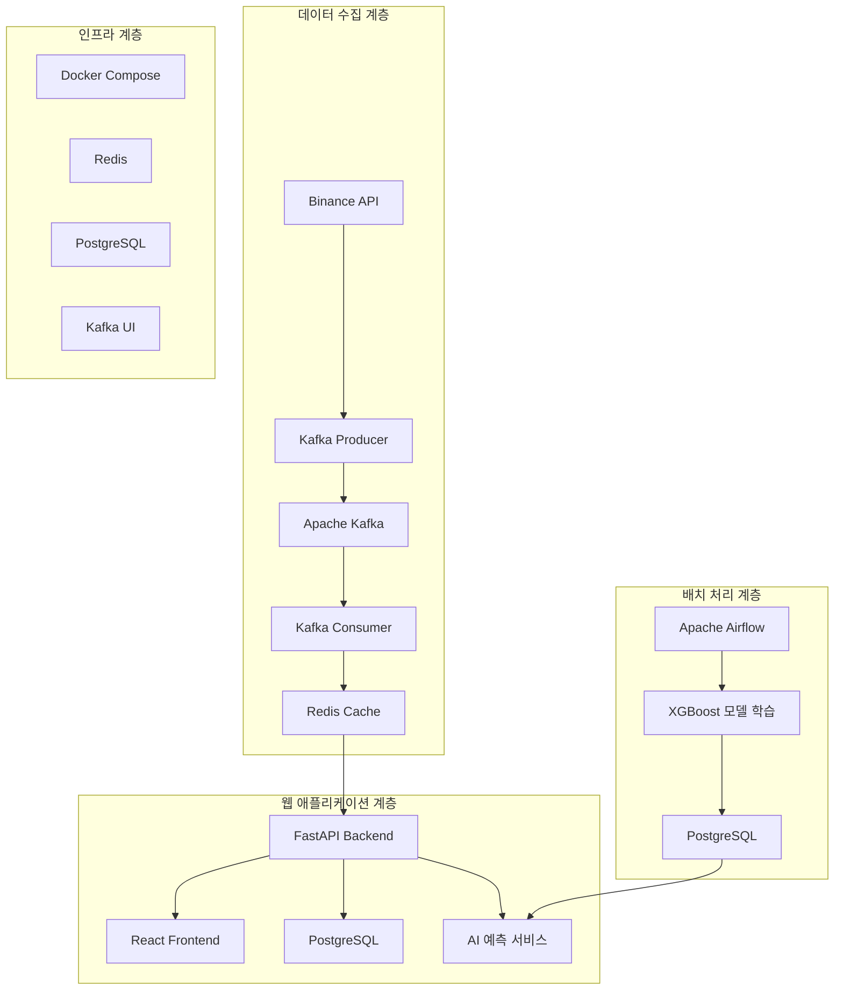

# 🚀 CryptoTrader - 실시간 암호화폐 모의 투자 플랫폼

> **XGBoost AI 기반 실시간 암호화폐 가격 예측 및 모의 거래 시스템**

[](https://www.docker.com/)
[](https://fastapi.tiangolo.com/)
[](https://reactjs.org/)
[](https://xgboost.readthedocs.io/)
[](https://airflow.apache.org/)

## 📋 프로젝트 개요

CryptoTrader는 실시간 암호화폐 데이터 수집, 머신러닝 기반 가격 예측, 그리고 모의 거래를 통합한 웹 기반 플랫폼입니다. Apache Airflow를 활용한 배치 처리와 Kafka를 통한 실시간 스트리밍, XGBoost AI 모델을 통한 가격 예측 기능을 제공합니다.

### ✨ 주요 기능

- 🔄 **실시간 데이터 수집**: Binance API를 통한 5초 간격 암호화폐 가격 수집
- 🤖 **AI 가격 예측**: XGBoost 머신러닝 모델 기반 가격 예측 및 투자 추천
- 💰 **모의 거래**: 가상 자금으로 실제와 동일한 거래 환경 체험
- 📊 **포트폴리오 관리**: 실시간 자산 추적 및 수익률 분석
- 📈 **실시간 차트**: Chart.js 기반 인터랙티브 가격 차트
- 🔐 **사용자 인증**: JWT 토큰 기반 보안 인증 시스템
- 💬 **AI 어시스턴트**: 투자 조언 및 시장 분석 챗봇

## 🏗️ 시스템 아키텍처



## 🛠️ 기술 스택

### Backend
- **FastAPI** - 고성능 Python 웹 프레임워크
- **PostgreSQL** - 메인 데이터베이스
- **Redis** - 실시간 데이터 캐싱
- **SQLAlchemy** - ORM
- **JWT** - 토큰 기반 인증
- **XGBoost** - 머신러닝 모델
- **Joblib** - 모델 직렬화

### Frontend
- **React 19.1.1** - 사용자 인터페이스
- **Chart.js** - 데이터 시각화
- **Axios** - HTTP 클라이언트
- **CSS3** - 스타일링

### Data Pipeline
- **Apache Kafka** - 실시간 데이터 스트리밍
- **Apache Airflow** - 워크플로우 오케스트레이션
- **Binance API** - 암호화폐 데이터 소스

### Infrastructure
- **Docker & Docker Compose** - 컨테이너화
- **Kafka UI** - Kafka 모니터링
- **PostgreSQL** - 데이터베이스

## 📁 프로젝트 구조

```
realtime_data/
├── 📊 kafka_services/           # Kafka 데이터 파이프라인
│   ├── producers/              # 데이터 생산자
│   │   └── crypo_producer.py   # Binance API 데이터 수집
│   ├── consumers/              # 데이터 소비자
│   │   └── crypo_consumers.py  # Redis 저장
│   └── requirements_kafka.txt  # Kafka 의존성
│
├── 🌐 backend/                 # FastAPI 백엔드
│   ├── main.py                # 메인 애플리케이션
│   ├── auth.py                # 인증 시스템
│   ├── database.py            # 데이터베이스 모델
│   ├── trading.py             # 거래 로직
│   ├── models/                # AI 모델 파일
│   └── requirements.txt       # 백엔드 의존성
│
├── 🎨 frontend/               # React 프론트엔드
│   ├── src/
│   │   ├── components/        # React 컴포넌트
│   │   ├── pages/            # 페이지 컴포넌트
│   │   └── contexts/         # React Context
│   └── package.json          # 프론트엔드 의존성
│
├── 🔄 dags/                   # Airflow DAG
│   └── crypto_batch_processing.py  # ML 모델 학습 워크플로우
│
├── 🐳 docker-compose.yaml     # 전체 서비스 오케스트레이션
├── 📄 Dockerfile              # Airflow 커스텀 이미지
└── 📚 문서/                   # 프로젝트 문서
```

## 🚀 빠른 시작

### 1. 사전 요구사항

- Docker & Docker Compose
- Git

### 2. 프로젝트 클론 및 실행

```bash
# 프로젝트 클론
git clone <repository-url>
cd realtime_data

# Docker Compose로 모든 서비스 시작
docker-compose up -d

# 로그 확인
docker-compose logs -f
```

### 3. 서비스 접속

- **웹 애플리케이션**: http://localhost:3000
- **API 문서**: http://localhost:8000/docs
- **Airflow 웹 UI**: http://localhost:8080 (airflow/airflow)
- **Kafka UI**: http://localhost:8081

### 4. 초기 설정

1. **회원가입**: 웹 애플리케이션에서 새 계정 생성
2. **데이터 수집 확인**: Kafka Producer가 Binance API에서 데이터를 수집하는지 확인
3. **AI 모델 학습**: Airflow에서 `crypto_batch_processing` DAG 실행

## 📊 주요 API 엔드포인트

### 인증 API
```http
POST /api/auth/register     # 회원가입
POST /api/auth/login        # 로그인
GET  /api/auth/me          # 현재 사용자 정보
```

### 시장 데이터 API
```http
GET /api/market/prices          # 현재 가격 조회
GET /api/market/top-gainers     # 상승률 TOP 코인
GET /api/market/symbol/{symbol} # 특정 코인 상세 정보
```

### 거래 API
```http
POST /api/trade/buy         # 매수
POST /api/trade/sell        # 매도
GET  /api/portfolio         # 포트폴리오 조회
GET  /api/transactions      # 거래 내역
```

### AI 예측 API
```http
POST /api/ai/assistant      # AI 어시스턴트 채팅
GET  /api/ai/predictions/{symbol}  # 특정 코인 가격 예측
```

## 🤖 AI 모델 정보

### XGBoost 모델
- **알고리즘**: XGBoost Regressor
- **특성**: 10개 시계열 가격 데이터 + 심볼 인코딩
- **학습 주기**: 6시간마다 자동 재학습
- **예측 범위**: 단기 가격 변동률

### 모델 성능 지표
- **R² Score**: 회귀 모델 설명력
- **MSE**: 평균 제곱 오차
- **실시간 정확도**: 지속적 모니터링

## 🔄 데이터 플로우

### 실시간 데이터 수집
```
Binance API → Kafka Producer → Kafka Topic → Consumer → Redis
```

### AI 모델 학습
```
Redis 데이터 → Airflow DAG → 특성 추출 → XGBoost 학습 → 모델 저장
```

### 웹 애플리케이션
```
React Frontend ↔ FastAPI Backend ↔ PostgreSQL/Redis
```

## 📈 주요 기능 상세

### 1. 실시간 가격 추적
- 5초 간격 실시간 가격 업데이트
- 상승률 TOP 코인 실시간 랭킹
- 가격 변동률 및 차트 시각화

### 2. 모의 거래 시스템
- 가상 자금 1,000,000 USDC로 시작
- 실시간 가격 기반 매수/매도
- 포트폴리오 실시간 수익률 계산

### 3. AI 투자 어시스턴트
- XGBoost 모델 기반 가격 예측
- 포트폴리오 분석 및 투자 조언
- 시장 동향 분석 및 추천

### 4. 사용자 관리
- JWT 토큰 기반 인증
- 개인별 포트폴리오 관리
- 거래 내역 추적

## 🔧 개발 및 운영

### 개발 환경 설정

```bash
# 백엔드 개발
cd backend
pip install -r requirements.txt
uvicorn main:app --reload

# 프론트엔드 개발
cd frontend
npm install
npm start
```

### 모니터링

- **Airflow**: DAG 실행 상태 모니터링
- **Kafka UI**: 메시지 처리 현황
- **Redis**: 캐시 데이터 상태
- **PostgreSQL**: 데이터베이스 성능

### 로그 확인

```bash
# 전체 서비스 로그
docker-compose logs -f

# 특정 서비스 로그
docker-compose logs -f fastapi-backend
docker-compose logs -f crypto-producer
```

## 🚨 문제 해결

### 일반적인 문제들

1. **Redis 연결 실패**
   ```bash
   docker-compose restart redis
   ```

2. **Kafka Producer 데이터 수집 안됨**
   ```bash
   docker-compose logs crypto-producer
   ```

3. **AI 모델 예측 불가**
   - Airflow에서 모델 학습 DAG 실행 확인
   - 모델 파일 존재 여부 확인

4. **프론트엔드 연결 오류**
   - 백엔드 서비스 상태 확인
   - CORS 설정 확인

## 📚 추가 문서

- [프로젝트 구조 설계](문서/프로젝트_구조_설계.md)
- [API 명세서](http://localhost:8000/docs)
- [Airflow DAG 문서](http://localhost:8080)

## 🤝 기여하기

1. Fork the Project
2. Create your Feature Branch (`git checkout -b feature/AmazingFeature`)
3. Commit your Changes (`git commit -m 'Add some AmazingFeature'`)
4. Push to the Branch (`git push origin feature/AmazingFeature`)
5. Open a Pull Request

## 📄 라이선스

이 프로젝트는 MIT 라이선스 하에 배포됩니다. 자세한 내용은 `LICENSE` 파일을 참조하세요.

## 📞 연락처

프로젝트 링크: [https://github.com/yourusername/realtime_data](https://github.com/yourusername/realtime_data)

---

⭐ 이 프로젝트가 도움이 되었다면 Star를 눌러주세요!
